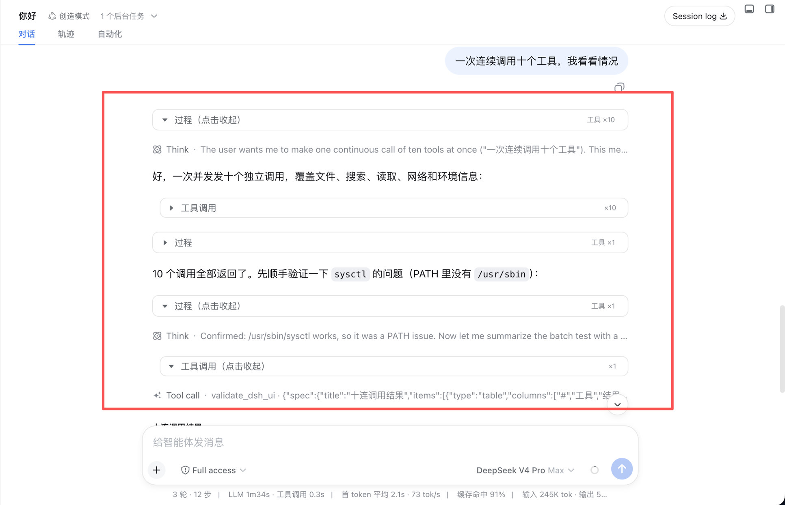
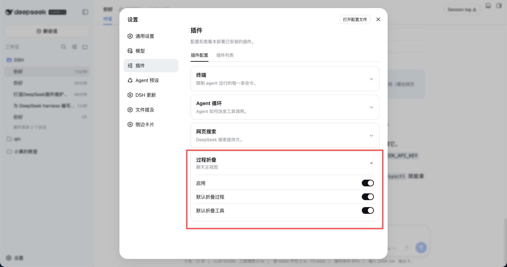

# dsh-folded-chat · 聊天过程两层折叠

DeepSeek Harness Web 插件：在聊天主视图把「思考 + 工具」收成两层折叠，不替换官方对话槽，官方工具卡片和其他 Chat 节点保持原样。

English UI follows the DSH locale.

```
[过程 ▸]              外层
  [思考]              官方 Think
  [工具调用 ▸]        内层
    bash / read / …
[助手正文]            始终可见
```



## 安装

前置：本机已能运行 `dsh web`。

```sh
dsh plugin --profile web add github:xingyingyuzhui/dsh-folded-chat
```

装完重启 `dsh web`。打开 **设置 → 插件 → 插件配置 → 过程折叠**。

## 设置



| 开关 | 作用 |
|---|---|
| 启用 | 总开关。关闭后折叠条消失，官方节点还原 |
| 默认折叠过程 | 已结束轮次是否默认收起外层 |
| 默认折叠工具 | 已结束轮次是否默认收起工具行 |

进行中的一轮默认展开。手动点过的组不再被自动改写。

## 卸载

```sh
dsh plugin --profile web remove dsh-folded-chat
```

## 开发

```sh
npm test
node scripts/build-client.mjs   # 改 fold-*.mjs 后重新生成 client.js
```

不要手改 `client.js`。

## License

MIT
